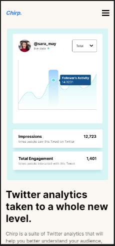

<h1 align="center">Chirp landing page | codewell.cc</h1>

   Solution for a challenge from  <a href="https://www.codewell.cc/" target="_blank">Codewell.cc</a>.

  <h3>
    <a href="https://chirp-landing-page-codewell-jimaxl.surge.sh">
      Demo
    </a>
     | 
    <a href="https://github.com/JimAxl1/Chirp-landing-page-codewell.cc">
      Solution
    </a>
     | 
    <a href="https://www.codewell.cc/challenges/chirp-landing-page--60fc1e36a383e41090a3c71c">
      Challenge
    </a>
  </h3>

<!-- TABLE OF CONTENTS -->

## Table of Contents

- [Overview](#overview)
  - [Built With](#built-with)
- [Features](#features)
- [Contact](#contact)

<!-- OVERVIEW -->

## Overview

Here are screenshots of how the page looks on three different devices, a cell phone, a tablet and a computer.

- This is a responsive page to be able to show what it could do.

- You can see my demo right <a href="https://chirp-landing-page-codewell-jimaxl.surge.sh">
      here :D
    </a>
- I made this page with the basic things of a frontend developer.

- Use sprites to display the images, which is a large png file that contains all the images displayed on the web page, in order to reduce the loading time for browsers.

- Use Sass (a css framework) so that all browsers can display the page to users, since there are properties in css that not all browsers can process :(

### Built With

- [HTML](https://www.w3schools.com/html/)
- [CSS](https://www.w3schools.com/css/default.asp)
- [JavaScript](https://www.javascript.com/)
- [Sass](https://sass-lang.com/)

## Features

This app/site was created as a submission to a [DevChallenges](https://devchallenges.io/challenges) challenge. The [challenge](https://devchallenges.io/challenges/0J1NxxGhOUYVqihwegfO) was to create a web identical to the given design.

## Contact

- GitHub [@JimAxl1](https://github.com/JimAxl1)
